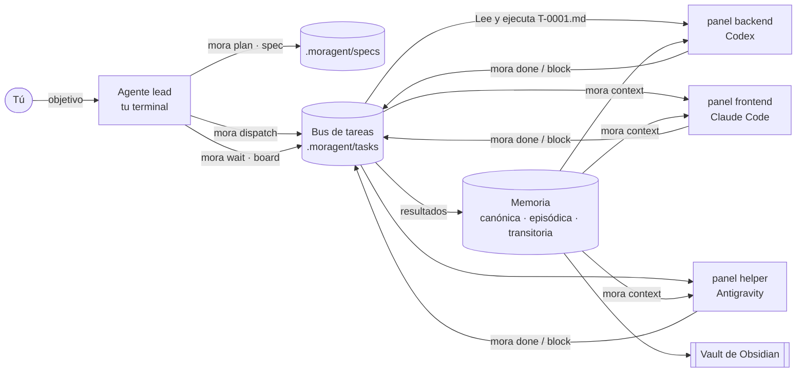

<div align="center">

```
█▀▄▀█ █▀█ █▀█ ▄▀█ █▀▀ █▀▀ █▄ █ ▀█▀
█ ▀ █ █▄█ █▀▄ █▀█ █▄█ ██▄ █ ▀█  █
```

**Un equipo de agentes de programación con IA — Claude Code, Codex, Antigravity, Pi — trabajando juntos en paneles reales de terminal, con tareas compartidas, memoria en capas y un segundo cerebro en Obsidian.**

[](https://www.npmjs.com/package/moragent)
[](LICENSE)
[](https://nodejs.org)
[](https://github.com/EduardoMoraga/moragent/stargazers)

[English](README.md) · [Sitio web](https://eduardomoraga.github.io/moragent/) · [Arquitectura](docs/ARCHITECTURE.md)

</div>

## Instalación

```sh
npm i -g moragent          # o bien: npx moragent
```

```sh
curl -fsSL https://raw.githubusercontent.com/EduardoMoraga/moragent/main/install.sh | sh
```

```powershell
# Windows (PowerShell)
irm https://raw.githubusercontent.com/EduardoMoraga/moragent/main/install.ps1 | iex
```

Después, dentro de cualquier repo:

```sh
mora
```

¿Sin proyecto? → un asistente corto (cinco preguntas, Enter acepta el valor por defecto). ¿Ya hay proyecto? → un panel con el siguiente paso sugerido. Node ≥ 18, cero dependencias npm.

<p align="center"><br><sub>Ilustración — la grabación real se genera con <code>vhs docs/demo.tape</code>.</sub></p>

## Por qué MORAGENT

Correr varios agentes a la vez es fácil. Lograr que **se repartan el trabajo, recuerden las decisiones y no se pisen** es lo difícil. MORAGENT es una capa ejecutiva delgada sobre las herramientas que ya usas:

| | MORAGENT | [herdr](https://herdr.dev) | gentle-ai | hello-sdd | tmux a mano |
|---|:-:|:-:|:-:|:-:|:-:|
| Agentes en paneles reales | ✓ (Orca · herdr · tmux · headless) | ✓ | — | — | ✓ |
| Mezclar proveedores en un equipo | ✓ | ✓ | ✓ | — | ✓ manual |
| Bus de tareas entre agentes | ✓ `dispatch` / `done` / `wait` | ~ enviar texto a paneles | — | — | — |
| Memoria en capas | ✓ canónica · episódica · transitoria · skills | — | ✓ | — | — |
| Fases guiadas por spec (SDD) | ✓ 8 fases, estado derivado de archivos | — | ✓ | ✓ | — |
| Segundo cerebro en Obsidian | ✓ `brain link` | — | — | — | — |
| Instalación en una línea | ✓ | ✓ | ✓ | ✓ | — |

<sub>Comparación basada en la documentación pública de cada proyecto a septiembre de 2026; si algo está mal, abre un issue. MORAGENT no reemplaza a herdr, Orca ni tmux: los **conduce**.</sub>

## Recorrido de 60 segundos

```sh
cd mi-app
mora init --preset trio --goal "Tienda online de café"   # o sólo `mora` para el asistente
mora doctor                                              # Node, CLIs, multiplexores, Obsidian, proyecto
mora plan "Checkout con Stripe, panel de administración y correos de confirmación"
#   muestra tamaño (S/M/L/XL), preset y roles recomendados, y crea la primera spec
mora spec status                                         # cada spec con su fase y su slug
mora up                                                  # un panel por rol, junto al tuyo
mora dispatch backend "API de pedidos con webhooks de Stripe" --spec <slug>
mora dispatch frontend "Pantalla de checkout" --spec <slug>
mora wait T-0001 T-0002                                  # espera hasta done / blocked / failed
mora board                                               # kanban del bus de tareas
mora memory add "Los pedidos usan UUIDv7" --tier canonical --kind decision --body "…"
mora brain link                                          # .moragent/ aparece en tu vault de Obsidian
```

Todo comando de lectura acepta `--json`. Todo comando funciona sin TTY, así que el propio agente lead puede ejecutar todo esto. Agrega `--dry-run` a `up` o `dispatch` para ver qué pasaría sin abrir paneles ni enviar nada.

## Cómo fluye



1. El **lead** (tu terminal actual) dimensiona el trabajo y escribe una spec.
2. `mora dispatch` escribe un **sobre** de tarea (`.moragent/tasks/T-0001.md`: misión, tarea, extracto de la spec, memoria relevante, criterios de aceptación y protocolo de salida) y escribe una sola línea en el panel del agente: *Lee y ejecuta .moragent/tasks/T-0001.md*.
3. El agente termina con `mora done T-0001 --summary "…"` o `mora block T-0001 --reason "…"`. El resultado queda como memoria episódica.
4. El lead espera con `mora wait`, revisa, integra y promueve las decisiones duraderas a memoria canónica.
5. Todo es markdown en `.moragent/`, que además es una carpeta de Obsidian.

## Conceptos

**Equipo (crew).** Roles con una misión y un CLI cada uno. Presets: `solo` (lead), `duo` (+backend), `trio` (+frontend), `squad` (+helper, +dev). Cambia quién hace qué con `mora crew set <rol> <cli>`.

**Bus.** Las tareas son archivos JSON con un estado: `queued → sent → running → done | failed | blocked`. Sin servidor ni daemon: cualquier agente de cualquier proveedor puede leerlas y escribirlas.

**Memoria en tres capas, más procedimientos.**

| Capa | Carpeta | Qué va ahí | Duración |
|---|---|---|---|
| Canónica | `memory/canonical/` | decisiones, convenciones, arquitectura | duradera, en git |
| Episódica | `memory/episodic/` | resultados de tareas, sesiones, hallazgos | sólo se agrega, en git |
| Transitoria | `memory/transient/` | borradores, traspasos | expira (`mora memory gc`) |
| Procedural | `skills/<nombre>/SKILL.md` | procedimientos reutilizables | sincronizada a cada CLI (`mora sync`) |

`mora context <rol> --query "…"` arma un paquete de contexto para un agente: notas canónicas, episodios recientes y los mejores resultados de búsqueda, dentro de un presupuesto de caracteres.

**Fases guiadas por spec.** `explore → propose → spec → design → tasks → apply → verify → archive`. La fase **se deriva de los archivos en disco** (requisitos EARS en `spec.md`, ítems `- [ ]` en `tasks.md`…), así que el binario —no el modelo— decide qué sigue: `mora spec next <slug>`.

**Segundo cerebro.** `mora brain link` enlaza `.moragent/` dentro de tu vault de Obsidian (o lo copia con `--copy`). Las notas usan frontmatter y `[[wikilinks]]`, y `Home.md` es un mapa de contenido generado, así que la vista de grafo muestra tareas, specs y decisiones conectadas.

## CLIs y multiplexores soportados

| CLI de agente | Lee | Skills | Instalación |
|---|---|---|---|
| Claude Code (`claude`) | `CLAUDE.md` → `@AGENTS.md` | `.claude/skills` | `npm i -g @anthropic-ai/claude-code` |
| Codex (`codex`) | `AGENTS.md` | `.agents/skills` | `npm i -g @openai/codex` |
| Antigravity (`agy`) | `GEMINI.md`, `AGENTS.md` | `.agents/skills` | `curl -fsSL https://antigravity.google/cli/install.sh \| bash` · Windows: `irm https://antigravity.google/cli/install.ps1 \| iex` ([repo](https://github.com/google-antigravity/antigravity-cli)) |
| Pi (`pi`) | `AGENTS.md` | `.agents/skills`, `.pi/skills` | `npm i -g @mariozechner/pi-coding-agent` |
| OpenCode (`opencode`) | `AGENTS.md` | `.agents/skills`, `.opencode/skill` | `npm i -g opencode-ai` |
| Gemini CLI (`gemini`) | `GEMINI.md` | `.agents/skills` | `npm i -g @google/gemini-cli` |

| Multiplexor | Se usa cuando | Notas |
|---|---|---|
| Orca | corres dentro de Orca (`ORCA_TERMINAL_HANDLE`) | divide junto a tu terminal |
| herdr | `HERDR_ENV=1` | paneles gestionados por herdr |
| tmux | estás dentro de tmux, o tmux está instalado | fuera de tmux crea una sesión en segundo plano y te dice cómo entrar |
| headless | no hay otro disponible | los agentes corren en segundo plano, logs en `.moragent/runs/` |

Fuerza uno con `mora up --mux tmux` o `mora config set mux tmux`.

`mora sync` mantiene un `AGENTS.md` canónico y escribe un bloque gestionado (entre marcadores `<!-- moragent:… -->`) en cada archivo que el equipo necesita. Nunca toca tu texto fuera de los marcadores.

## Autonomía y seguridad

Un agente que se detiene a preguntar "¿puedo ejecutar `mora done`?" en un panel que nadie está mirando traba a todo el equipo. Por eso cada rol tiene un nivel de autonomía en `crew.<rol>.autonomy`:

| Modo | Qué puede hacer el agente sin preguntar | Flags que pasa MORAGENT |
|---|---|---|
| `auto` **(por defecto)** | editar archivos del repo y ejecutar `mora …`, `node`, `npm test`, `git status` y `git diff`; lo demás sigue preguntando (Claude) o queda dentro del sandbox del workspace (Codex) | Claude: `--permission-mode acceptEdits --allowedTools "Bash(mora:*)" "Bash(npm test:*)" "Bash(node:*)" "Bash(git status:*)" "Bash(git diff:*)"` · Codex: `-s workspace-write -a never` · Antigravity: `--mode accept-edits` · Gemini: `--approval-mode auto_edit` |
| `full` | cualquier cosa: sin preguntas ni sandbox | Claude/Antigravity: `--dangerously-skip-permissions` · Codex: `--dangerously-bypass-approvals-and-sandbox` · Gemini: `--yolo` |
| `ask` | nada; aplican las preguntas propias del CLI | ninguno |

Pi y OpenCode no piden permisos, así que no reciben flags extra. Las ejecuciones headless nunca son `ask` (nadie podría responder): corren al menos en `auto`.

**Por qué `auto` es el default:** es el mínimo de permisos con el que un agente puede terminar una tarea y reportar solo. Codex mantiene su sandbox del workspace y Claude sólo ejecuta sin preguntar los comandos de la lista.

```sh
mora config set crew.backend.autonomy full   # un rol, guardado en moragent.json
mora up --yolo                               # cada panel que abre este comando corre en full
```

Usa `full` / `--yolo` sólo en un entorno desechable (contenedor, VM, rama de prueba) que no te importe perder. La primera vez que un CLI se abre en una carpeta puede preguntar si confías en ella: `mora up` te lo recuerda, y `dispatch` a un panel de Orca no envía nada mientras ese diálogo esté en pantalla.

## Memoria automática

Cada sesión de un agente deja sola una nota episódica. `mora init` instala los hooks de captura (omítelos con `--no-hooks`) y `mora sync --hooks` los agrega a un proyecto existente. Llaman a `mora` (o a `npx -y moragent` si `mora` no está en tu PATH):

- **Claude Code** — un hook `SessionEnd` en `.claude/settings.json` ejecuta `mora memory capture --from claude`.
- **Codex** — `notify = ["mora", "memory", "capture", "--from", "codex"]` en `.codex/config.toml`, llamado al final de cada turno.

Nunca reemplaza hooks ni un `notify` que ya tengas; `mora sync --hooks --dry-run` muestra qué escribiría.

La captura es determinista (sin LLM): guarda el primer pedido, la última respuesta, los archivos editados y algunos comandos relevantes, en **una nota por sesión**. Omite las sesiones triviales y oculta todo lo que parezca un secreto (`sk-…`, `ghp_…`, `AKIA…`, llaves privadas). Un error de captura nunca rompe a tu agente: queda registrado en `.moragent/runs/capture.log`.

## Plugin para Claude Code y Codex

El mismo repo es plugin para ambos y trae las skills de MORAGENT (protocolo del lead, protocolo de los agentes, specs, memoria):

```text
# Claude Code
/plugin marketplace add EduardoMoraga/moragent
/plugin install moragent@moragent

```

Para Codex, el repo trae `.codex-plugin/plugin.json`, que apunta a las mismas skills en `plugin/skills/`.

Las skills usan el CLI `mora` (o `npx moragent` si no está instalado).

## Preguntas frecuentes — si vienes del chat

**¿Necesito saber tmux?** No. Dentro de Orca o herdr los paneles se abren solos; si sólo tienes tmux, MORAGENT crea la sesión y te muestra el único comando para entrar. Si no tienes nada, los agentes corren en segundo plano y sigues el avance en el tablero.

**¿Es una IA o varias?** Varios CLIs de agentes independientes, cada uno en su panel y con su propia cuenta. MORAGENT les da una lista de tareas y una memoria compartidas.

**¿Envía mi código a algún lado?** MORAGENT no hace llamadas de red. Los CLIs de agentes que uses hablan con sus propios proveedores, igual que sin MORAGENT.

**¿Cuánto cuesta?** MORAGENT es gratis (MIT). Cada CLI de agente usa tu suscripción o API key existente.

**Sólo tengo Claude Code.** Funciona: todos los roles pueden usar el mismo CLI. `mora doctor` te dice qué falta y cómo instalarlo.

**¿Puedo deshacerlo?** Todo vive en `.moragent/` más un bloque marcado en `AGENTS.md` / `CLAUDE.md` / `GEMINI.md`. Bórralos y quedas como estabas.

## Contribuir

Issues y PRs bienvenidos: lee [CONTRIBUTING.md](CONTRIBUTING.md) y el contrato en [docs/ARCHITECTURE.md](docs/ARCHITECTURE.md). `npm test` corre toda la suite; los tests nunca lanzan un agente ni un multiplexor real.

## Licencia

[MIT](LICENSE) © Eduardo Moraga

---

<p align="center">Si MORAGENT te ahorra unos cuantos cambios de contexto, <a href="https://github.com/EduardoMoraga/moragent">dale una ⭐</a>: ayuda a que otras personas lo encuentren.</p>
