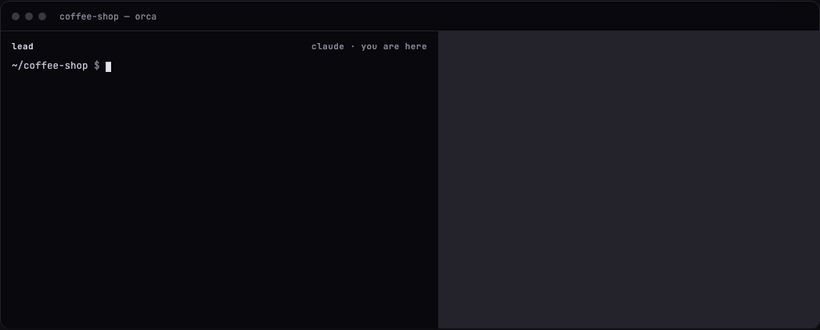
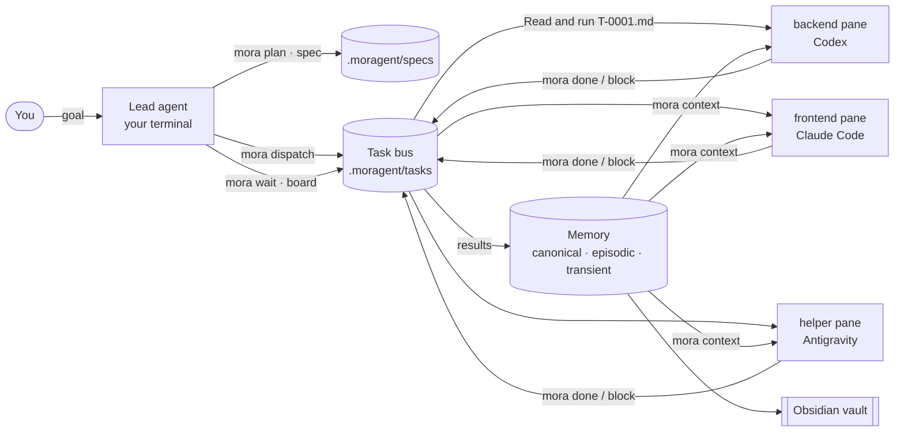

<div align="center">

```
█▀▄▀█ █▀█ █▀█ ▄▀█ █▀▀ █▀▀ █▄ █ ▀█▀
█ ▀ █ █▄█ █▀▄ █▀█ █▄█ ██▄ █ ▀█  █
```

**One crew of AI coding agents — Claude Code, Codex, Antigravity, Pi — working together in real terminal panes, with shared tasks, layered memory and an Obsidian second brain.**

[](https://www.npmjs.com/package/moragent)
[](LICENSE)
[](https://nodejs.org)
[](https://github.com/EduardoMoraga/moragent/stargazers)

[Español](README.es.md) · [Website](https://eduardomoraga.github.io/moragent/) · [Architecture](docs/ARCHITECTURE.md)

</div>

## Install

```sh
npm i -g moragent          # or: npx moragent
```

```sh
curl -fsSL https://raw.githubusercontent.com/EduardoMoraga/moragent/main/install.sh | sh
```

```powershell
# Windows (PowerShell)
irm https://raw.githubusercontent.com/EduardoMoraga/moragent/main/install.ps1 | iex
```

Then, inside any repo:

```sh
mora
```

No project yet → a short wizard (five questions, Enter accepts the default). Project already there → a dashboard with the next step to take. Node ≥ 18, zero npm dependencies.

<p align="center"><br><sub>Illustration — the real recording is generated with <code>vhs docs/demo.tape</code>.</sub></p>

## Why MORAGENT

Running several coding agents at once is easy. Getting them to **share work, remember decisions and not step on each other** is the hard part. MORAGENT is a thin executive layer on top of the tools you already use:

| | MORAGENT | [herdr](https://herdr.dev) | gentle-ai | hello-sdd | tmux by hand |
|---|:-:|:-:|:-:|:-:|:-:|
| Agents in real panes | ✓ (Orca · herdr · tmux · headless) | ✓ | — | — | ✓ |
| Mix vendors in one crew | ✓ | ✓ | ✓ | — | ✓ manual |
| Task bus between agents | ✓ `dispatch` / `done` / `wait` | ~ send text to panes | — | — | — |
| Layered memory | ✓ canonical · episodic · transient · skills | — | ✓ | — | — |
| Spec-driven phases | ✓ 8 phases, state derived from files | — | ✓ | ✓ | — |
| Obsidian second brain | ✓ `brain link` | — | — | — | — |
| One-line install | ✓ | ✓ | ✓ | ✓ | — |

<sub>Comparison based on each project's public docs as of September 2026 — open an issue if something is wrong. MORAGENT does not replace herdr, Orca or tmux: it **drives** them.</sub>

## 60-second tour

```sh
cd my-app
mora init --preset trio --goal "Online coffee shop"   # or just `mora` for the wizard
mora doctor                                           # Node, CLIs, multiplexers, Obsidian, project
mora plan "Stripe checkout, admin dashboard and email receipts"
#   prints size (S/M/L/XL), recommended preset and roles, and creates the first spec
mora spec status                                      # every spec with its phase and slug
mora up                                               # one pane per role, next to yours
mora dispatch backend "Orders API with Stripe webhooks" --spec <slug>
mora dispatch frontend "Checkout screen" --spec <slug>
mora wait T-0001 T-0002                               # blocks until done / blocked / failed
mora board                                            # kanban of the task bus
mora memory add "Orders use UUIDv7" --tier canonical --kind decision --body "…"
mora brain link                                       # .moragent/ shows up in your Obsidian vault
```

Every read command takes `--json`. Every command works without a TTY, so the lead agent itself can run all of this. Add `--dry-run` to `up` or `dispatch` to see what would happen without opening panes or sending anything.

## How it flows



1. The **lead** (your current terminal) sizes the work and writes a spec.
2. `mora dispatch` writes a task **envelope** (`.moragent/tasks/T-0001.md`: mission, task, spec excerpt, relevant memory, acceptance criteria, exit protocol) and types one line into the worker's pane: *Read and run .moragent/tasks/T-0001.md*.
3. The worker finishes with `mora done T-0001 --summary "…"` or `mora block T-0001 --reason "…"`. The result becomes episodic memory.
4. The lead `mora wait`s, reviews, integrates, and promotes durable decisions to canonical memory.
5. Everything is markdown in `.moragent/`, which doubles as an Obsidian folder.

## Concepts

**Crew.** Roles with a mission and a CLI each. Presets: `solo` (lead), `duo` (+backend), `trio` (+frontend), `squad` (+helper, +dev). Change who does what with `mora crew set <role> <cli>`.

**Bus.** Tasks are JSON files with a status: `queued → sent → running → done | failed | blocked`. No server, no daemon — any agent from any vendor can read and write them.

**Memory in three layers, plus procedures.**

| Layer | Folder | What goes there | Lifetime |
|---|---|---|---|
| Canonical | `memory/canonical/` | decisions, conventions, architecture | durable, git-tracked |
| Episodic | `memory/episodic/` | task results, sessions, findings | append-only, git-tracked |
| Transient | `memory/transient/` | scratch, handoffs | expires (`mora memory gc`) |
| Procedural | `skills/<name>/SKILL.md` | reusable how-tos | synced to every CLI (`mora sync`) |

`mora context <role> --query "…"` compiles a context pack for an agent: canonical notes, recent episodes and the best recall matches, within a character budget.

**Spec-driven phases.** `explore → propose → spec → design → tasks → apply → verify → archive`. The phase is **derived from the files on disk** (EARS requirements in `spec.md`, `- [ ]` items in `tasks.md`…), so the binary — not the model — decides what comes next: `mora spec next <slug>`.

**Second brain.** `mora brain link` symlinks `.moragent/` into your Obsidian vault (or copies it with `--copy`). Notes use frontmatter and `[[wikilinks]]`, and `Home.md` is a generated map of content, so the graph view shows tasks, specs and decisions connected.

## Supported CLIs and multiplexers

| Agent CLI | Reads | Skills | Install |
|---|---|---|---|
| Claude Code (`claude`) | `CLAUDE.md` → `@AGENTS.md` | `.claude/skills` | `npm i -g @anthropic-ai/claude-code` |
| Codex (`codex`) | `AGENTS.md` | `.agents/skills` | `npm i -g @openai/codex` |
| Antigravity (`agy`) | `GEMINI.md`, `AGENTS.md` | `.agents/skills` | `curl -fsSL https://antigravity.google/cli/install.sh \| bash` · Windows: `irm https://antigravity.google/cli/install.ps1 \| iex` ([repo](https://github.com/google-antigravity/antigravity-cli)) |
| Pi (`pi`) | `AGENTS.md` | `.agents/skills`, `.pi/skills` | `npm i -g @mariozechner/pi-coding-agent` |
| OpenCode (`opencode`) | `AGENTS.md` | `.agents/skills`, `.opencode/skill` | `npm i -g opencode-ai` |
| Gemini CLI (`gemini`) | `GEMINI.md` | `.agents/skills` | `npm i -g @google/gemini-cli` |

| Multiplexer | Picked when | Notes |
|---|---|---|
| Orca | running inside Orca (`ORCA_TERMINAL_HANDLE`) | splits next to your terminal |
| herdr | `HERDR_ENV=1` | panes managed by herdr |
| tmux | inside tmux, or tmux is installed | outside tmux it creates a detached session and tells you how to attach |
| headless | nothing else available | agents run in the background, logs in `.moragent/runs/` |

Force one with `mora up --mux tmux` or `mora config set mux tmux`.

`mora sync` keeps one canonical `AGENTS.md` and writes a managed block (between `<!-- moragent:… -->` markers) into each file the crew needs. It never touches your text outside the markers.

## Autonomy and safety

A worker that stops to ask "may I run `mora done`?" in a pane nobody is watching stalls the whole crew. So every role has an autonomy level, set in `crew.<role>.autonomy`:

| Mode | What the agent may do without asking | Flags MORAGENT passes |
|---|---|---|
| `auto` **(default)** | edit files in the repo and run `mora …`, `node`, `npm test`, `git status` and `git diff`; everything else still asks (Claude) or stays inside the workspace sandbox (Codex) | Claude: `--permission-mode acceptEdits --allowedTools "Bash(mora:*)" "Bash(npm test:*)" "Bash(node:*)" "Bash(git status:*)" "Bash(git diff:*)"` · Codex: `-s workspace-write -a never` · Antigravity: `--mode accept-edits` · Gemini: `--approval-mode auto_edit` |
| `full` | anything — no prompts, no sandbox | Claude/Antigravity: `--dangerously-skip-permissions` · Codex: `--dangerously-bypass-approvals-and-sandbox` · Gemini: `--yolo` |
| `ask` | nothing; the CLI's own prompts apply | none |

Pi and OpenCode do not prompt for permissions, so they get no extra flags. Headless runs are never `ask` (nobody could answer): they run at least as `auto`.

**Why `auto` is the default:** it is the smallest set of permissions that lets a worker finish a task and report back on its own. Codex keeps its workspace sandbox, and Claude can only run the commands on the list without asking.

```sh
mora config set crew.backend.autonomy full   # one role, persisted in moragent.json
mora up --yolo                               # every pane opened by this command runs in full
```

Use `full` / `--yolo` only in a disposable environment (container, VM, throwaway branch) you are fine losing. The first time a CLI opens in a folder it may ask whether you trust it: `mora up` reminds you, and `dispatch` to an Orca pane refuses to send while that dialog is on screen.

## Automatic memory

Every agent session leaves an episodic note on its own. `mora init` installs the capture hooks (skip with `--no-hooks`), and `mora sync --hooks` adds them to an existing project. They call `mora` (or `npx -y moragent` when `mora` is not on your PATH):

- **Claude Code** — a `SessionEnd` hook in `.claude/settings.json` runs `mora memory capture --from claude`.
- **Codex** — `notify = ["mora", "memory", "capture", "--from", "codex"]` in `.codex/config.toml`, called after each turn.

It never replaces hooks or a `notify` you already have; `mora sync --hooks --dry-run` shows what it would write.

Capture is deterministic (no LLM): it keeps the first request, the last answer, the files edited and a few relevant commands, as **one note per session**. It skips trivial sessions and redacts anything that looks like a secret (`sk-…`, `ghp_…`, `AKIA…`, private keys). A capture error never breaks your agent: it is logged to `.moragent/runs/capture.log`.

## Plugin for Claude Code and Codex

The same repo is a plugin for both, shipping the MORAGENT skills (lead protocol, worker protocol, specs, memory):

```text
# Claude Code
/plugin marketplace add EduardoMoraga/moragent
/plugin install moragent@moragent

```

For Codex, the repo ships `.codex-plugin/plugin.json`, which points at the same skills in `plugin/skills/`.

The skills call the `mora` CLI (falling back to `npx moragent` when it is not installed).

## FAQ — coming from a chat window

**Do I need to know tmux?** No. Inside Orca or herdr panes open by themselves; with only tmux installed, MORAGENT creates the session and prints the one command to attach. With nothing, agents run headless and you watch the board.

**Is it one AI or several?** Several independent agent CLIs, each in its own pane, each logged in with its own account. MORAGENT gives them a shared to-do list and a shared memory.

**Does it send my code anywhere?** MORAGENT itself makes no network calls. The agent CLIs you run talk to their own providers, exactly as they do without MORAGENT.

**What does it cost?** MORAGENT is free (MIT). Each agent CLI uses your existing subscription or API key.

**I only have Claude Code.** That works: every role can use the same CLI. `mora doctor` tells you what is missing and how to install it.

**Can I undo it?** Everything lives in `.moragent/` plus a marked block in `AGENTS.md` / `CLAUDE.md` / `GEMINI.md`. Delete those and you are back where you started.

## Contributing

Issues and PRs welcome — read [CONTRIBUTING.md](CONTRIBUTING.md) and the contract in [docs/ARCHITECTURE.md](docs/ARCHITECTURE.md). `npm test` runs the whole suite; tests never launch a real agent or multiplexer.

## License

[MIT](LICENSE) © Eduardo Moraga

---

<p align="center">If MORAGENT saves you a few context switches, <a href="https://github.com/EduardoMoraga/moragent">give it a ⭐</a> — it helps other people find it.</p>
